# Current conditional field implementation

This describes the frozen004 method being trained, not a performance claim.
The authoritative source is
[codec.py](/Users/chen/Documents/ChatGPT/paper6/experiments/cost-field/code_004/codec.py).
The current scope is seed17 and fixedfinalepoch3; historical three-seed plans
are superseded by scope007.

```mermaid
flowchart LR
    I[Left/right images + calibration] --> F[Frozen LIGA stereo front end]
    F --> C[Cost field + appearance + native depth guide]
    C --> E[Learned score + 3 equal-mass barycenters]
    E --> X[3 position + 12 feature + 4 appearance complex symbols per site]
    X --> H[AWGN or iid Rayleigh / perfect CSI]
    H --> D[Received symbols only: phase coordinates + sphere projection]
    D --> R[Unnormalized Gaussian field + appearance decoder]
    R --> T[Frozen 3D task head]
```

At each spatially pooled site, let c_d be32-channel cost features and z_d the
72 fixed metric query depths spanning2..59.6m. The source cost sweep is a
different axis; these query coordinates follow the native interpolation
contract. Appearance a has32 channels. Spatial average pooling stride4 applies
to c,a and the frozen native softmax depth guide pi, followed by depth-mass
renormalization. The guide is not a calibrated posterior.

For P, p_d=softmax_d(s_theta(c_d)+log pi_d), with a learned32→16→1 score
network. Intersect the discrete CDF atoms with each of three probability
intervals[j/3,(j+1)/3]. Normalize each interval's residual masses to weights
w_jd, then transmit the barycenters mu_j=sum_d w_jd z_d and conditional feature
values v_j=sum_d w_jd A_theta(c_d), where A maps32→8 channels. This is a
quantile barycenter construction, not a new optimal-transport theorem.

Each mu_j is represented by one unit-energy exp(i theta_j), where
theta_j=pi*(mu_j-2)/57.6-pi/2. Each eight-real-channel v_j occupies four
complex symbols jointly normalized to energy4. Appearance's eight real
channels occupy four complex symbols normalized to energy4. The total is
3+3*4+4=19 complex uses and energy19 per pooled site. The normalization removes
source magnitude; no private norm is sent to the receiver. The known tensor
shape/query axis is shared system configuration, not a transmitted image.

The receiver obtains mu_hat through projected phase with atan2 and clipping,
and v_hat through each known sphere constraint followed by an8→32 decoder.
At query depth z_d it reconstructs

\[
\widehat c_d=\frac13\sum_{j=1}^3
 \exp[-(z_d-\widehat\mu_j)^2/(2\sigma^2)]\,D_\theta(\widehat v_j).
\]

The basis weights are deliberately **not normalized across nodes**. The old
normalized form erased geometry when conditional values were identical; that
failure and correction remain in the historical protocols. Sigma is a learned
positive scalar shared across sites, not an adaptive or calibrated uncertainty.
Trilinear spatial/depth interpolation restores the native cost shape; bilinear
appearance interpolation restores its shape. No clean features, source means,
private scales, guide probabilities, ROI masks or labels enter decode().

G shares the P architecture but omits log pi. S shares it but shifts pi by
half its pooled height and width (a spatial roll), testing correspondence of
local guide and feature. B is a stronger dense-depth control: it includes the
centered native log guide and uses learned72→3→72 depth transformations with
10 real feature channels. Its15 feature complex symbols are normalized as
one energy15 group; appearance is the same four-symbol group. B has1751
functional parameters versus1650 for G/P/S. Equal uses/energy do not mean
equal capacity or equal normalization. P-B compares complete architectures;
P-G/P-S better isolate the prior and its spatial organization.

Only codec weights learn from genuine downstream classification/localization/
direction losses; the full484-state LIGA network is frozen. Labels appear on
the loss side after sensor-only forward. Training traverses all3712 public
training pairs three times per arm, with matched real noise/fading per step.
The stereo cost front end itself remains computationally expensive. Claims
of lightweight edge deployment, geometry sufficiency, calibrated uncertainty,
task RD optimality or new-method AP gains are not supported by this design
description. The fixed full validation and actual resource controls are required.
